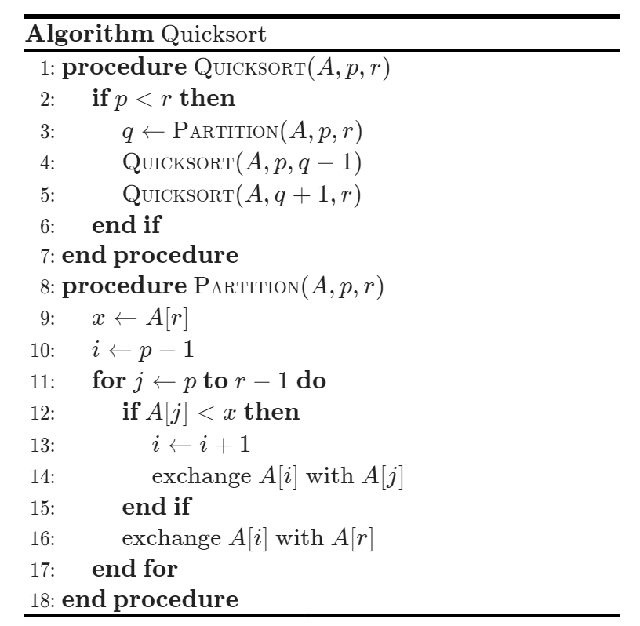

# Obsidian-Pseudocode
- [Obsidian-Pseudocode](#obsidian-pseudocode)
  - [Features](#features)
    - [Future Features](#future-features)
  - [Usage](#usage)
    - [Basic](#basic)
    - [Preamble style customization](#preamble-style-customization)
    - [Export to a compilable LaTeX file](#export-to-a-compilable-latex-file)
  - [Installation](#installation)
    - [Install from the Community Plugins in Obsidian.](#install-from-the-community-plugins-in-obsidian)
    - [Use BRAT](#use-brat)
    - [Manual install](#manual-install)
  - [Credits](#credits)

This is a plugin for [Obsidian](https://obsidian.md/) that allows you to render LaTeX-style pseudocode inside a code block. The plugin is based on [pseudocode.js](https://github.com/SaswatPadhi/pseudocode.js), a JavaScript library that typesets pseudocode beautifully to HTML.

## Features

- Intuitive grammar: The plugin takes a LaTeX-style input that supports the algorithmic constructs from LaTeX's algorithm packages. With or without LaTeX experience, a user should find the grammar fairly intuitive.
- Print quality: The HTML output produced by the plugin is (almost) identical with the pretty algorithms printed on publications that are typeset by LaTeX.
- Math formula support: Inserting math formulas in the pseudocode is as easy as LaTeX. Just enclose math expression in `$...$` or `\(...\)`.
- Auto-completion inside `pseudo` code block. (Release 1.1.0)
- [Preamble style (macros) customization.](#preamble-style-customization) (Release 1.2.0)
- [Export a LaTeX file that can be compiled, including any required additional macros.](#export-to-a-compilable-latex-file) (Release 1.3.0)

### Future Features

- [ ] Syntax highlighting.

## Usage

### Basic

To use the plugin, simply create a code block in your Obsidian note and add your pseudocode inside it. Then, add the language specifier `pseudo` (short for "pseudocode") to the code block. The plugin will automatically render the pseudocode as LaTeX.

**Rocommend: use the command `Pseudocode: Insert a new pseudocode block` to start.**

Here is an example:

```
    ```pseudo
    \begin{algorithm}
    \caption{Quicksort}
    \begin{algorithmic}
      \Procedure{Quicksort}{$A, p, r$}
        \If{$p < r$}
          \State $q \gets $ \Call{Partition}{$A, p, r$}
          \State \Call{Quicksort}{$A, p, q - 1$}
          \State \Call{Quicksort}{$A, q + 1, r$}
        \EndIf
      \EndProcedure
      \Procedure{Partition}{$A, p, r$}
        \State $x \gets A[r]$
        \State $i \gets p - 1$
        \For{$j \gets p$ \To $r - 1$}
          \If{$A[j] < x$}
            \State $i \gets i + 1$
            \State exchange
            $A[i]$ with $A[j]$
          \EndIf
        \State exchange $A[i]$ with $A[r]$
        \EndFor
      \EndProcedure
      \end{algorithmic}
    \end{algorithm}
    ```
```

This will be rendered as:

<div align="center">

</div>

### Preamble style customization

You can use a `.sty` file (actually the suffix does not matter) to customize with some macros. The plugin will locate the file according to the setting. The default path is `preamble.sty`. Currently supported macros can be found at [this link](https://katex.org/docs/supported.html#macros) and below(might not be fully supported):

1. `\DeclarePairedDelimiter`
2. `\DeclareMathOperator*`
3. `\DeclareMathOperator`

Please reload the plugin after you change the preamble file.

### Export to a compilable LaTeX file

You can easily export a compilable LaTeX file by clicking the `Export to clipboard` button at the bottom right corner for each pseudocode block. The plugin will automatically generate a compilable LaTeX file, including any required additional macros, to your clipboard.


## Installation

### Install from the Community Plugins in Obsidian.

:tada: The Pseudocode plugin is now available in the Community Plugins section of Obsidian. To install it, simply search for **Pseudocode** and click on the installation button.

### Use [BRAT](https://github.com/TfTHacker/obsidian42-brat#Quick-Guide-for-using-BRAT)

1. Install **Obsidian-42 BRAT** from the Community Plugins in Obsidian.
2. Open the command palette and run the command `BRAT: Add a beta plugin for testing`. Input this repo's URL `https://github.com/Yaotian-Liu/obsidian-pseudocode`.
3. Click on **Add Plugin** -- wait a few seconds and BRAT will tell you what is going on.
4. After BRAT confirms the installation, in Settings go to the **Community plugins** tab.
5. Refresh the list, find `Pseudocode` and enable it.

### Manual install

1. Create a folder named `pseudocode-in-obs` in your Obsidian vault plugin folder (which is {Your Vault}/.obsidian/plugins).
2. Download `main.js`, `manifest.json` and `styles.css` from the [releases page](https://github.com/yaotian-liu/obsidian-pseudocode/releases/latest), to the folder you just created in step 1.
3. Open your Obsidian, and enable the plugin in "Community Plugins" setting page.
4. Enjoy.

<!-- ## Known Issues -->

## Credits

This plugin is based on [pseudocode.js](https://github.com/SaswatPadhi/pseudocode.js), a JavaScript library that typesets pseudocode beautifully to HTML. Many thanks to the pseudocode.js team for their great work!
